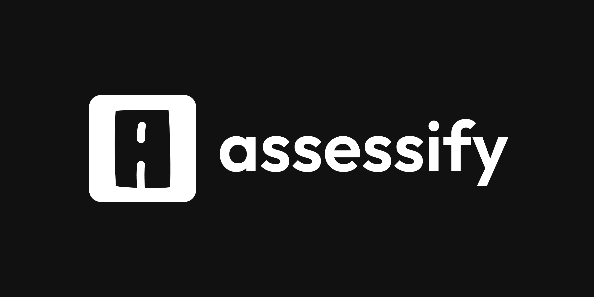

<p align="center">
  
</p>

<h1 align="center">Assessify Backend</h1>

<p align="center">
<b>Comprehensive backend for Assessify: a classroom quiz and assessment platform built with Django & DRF.</b>
</p>

---

<p align="center">
  <a href="https://github.com/abduakhads/assessify-backend/actions/workflows/django.yml">
    
  </a>
  <a href="https://github.com/abduakhads/assessify-backend/actions/workflows/github-code-scanning/codeql">
    
  </a>
</p>

## 🚀 Project Overview

Assessify Backend is an advanced assessment platform for classrooms, built for flexibility, security, and easy integration.

### ✨ Features

- **Multiple Test Types:** Teachers can create a variety of test formats (MCQ, written, etc.) for each quiz.
- **Per-Question Time Limits:** Each question can have its own time limit, enforced and computed on the server for strong security (prevents browser tampering).
- **Secure Attempts:** All timing and attempt logic is handled server-side, making cheating via browser manipulation much harder.
- **Open API:** Developers can integrate Assessify's API into their own projects. Full, public API docs are available.
- **API Documentation:** Visit [Swagger](https://api.assessify.app/) or [Redoc](https://api.assessify.app/redoc/) for live, interactive endpoint documentation.
- **Classroom & Enrollment:** Manage classrooms, students, and enrollment codes easily.
- **Comprehensive Stats:** Teachers get detailed stats on student performance and quiz attempts.
- **Modern Auth:** JWT authentication, user activation, and password reset flows.

### Tech Stack

- Django 5.2.4
- Django REST Framework
- JWT Auth (SimpleJWT)
- Djoser (user management)
- drf-spectacular (OpenAPI docs)
- Silk (profiling, dev optimization)

---

## 🛠️ Getting Started

### 1. Clone & Install

```bash
git clone https://github.com/abduakhads/assessify-backend.git

cd assessify-backend

python -m venv venv

source venv/bin/activate

pip install -r requirements.txt
```

### 2. Environment Variables

Copy `.env.example` to `.env` and fill in required values:

```bash
cp .env.example .env
# Edit .env with your secrets & config
```

Required variables:

- `SECRET_KEY`, `DJANGO_DEBUG`, `DATABASE_URL`, `ALLOWED_HOSTS`
- Email settings for activation (see `.env.example`)

### 3. Migrate & Run

```bash
python manage.py migrate
python manage.py runserver
```

### 4. API Docs

- Swagger: [https://api.assessify.app/](https://api.assessify.app/)
- Redoc: [https://api.assessify.app/redoc/](https://api.assessify.app/redoc/)

---

## 🧪 Testing

Run all tests:

```bash
python manage.py test
```

Check coverage (must be 100% for models & views to contribute):

```bash
coverage run manage.py test
coverage report -m
```

Tests are located in:

- `base/tests/` (models, serializers)
- `api/tests/` (views, integration)

---

## 🏗️ Contributing

We welcome PRs! To contribute:

1. **Fork & branch** from `main`.
2. **Add/modify code**. All new features/bugfixes must include relevant tests.
3. **Ensure coverage**: Models & views must be 100% covered (see above).
4. **Open a Pull Request**. The CI will run tests and check coverage.
5. **Describe your change** clearly in the PR.

**Note:** PRs without tests or with reduced coverage will not be accepted.

---

## ⚡ Development Tips

- **Silk profiling**: Silk is enabled in development (`DJANGO_DEBUG=True`).
  - Access Silk dashboard at `/silk/` for request profiling & query optimization.
  - See [Silk docs](https://github.com/jazzband/django-silk) for usage.
- **drf-spectacular**: API schema at `/schema/`, Swagger at `/`, Redoc at `/redoc/`.
- **Custom admin access**: Only staff can access `/admin/` (see `config/middleware.py`).

---

## 📦 Project Structure

```
backend/
├── api/            # API views, routers, tests
├── base/           # Core models, serializers, permissions, tests
├── config/         # Django settings, middleware, custom exceptions
├── staticfiles/    # Static assets
├── templates/      # Email templates
├── manage.py       # Django entrypoint
├── requirements.txt
├── .env.example    # Example environment config
└── ...
```

---

## 🙏 Acknowledgements

- [Django](https://www.djangoproject.com/)
- [DRF](https://www.django-rest-framework.org/)
- [Silk](https://github.com/jazzband/django-silk)
- [drf-spectacular](https://drf-spectacular.readthedocs.io/)
